# Google Earth

**Google Earth** 是由Google开发的一款地图工具，目前可供使用的有 **Web版** 、 **桌面版** 两种版本。

主要功能是查看区域的 **地图** 、 **卫星图片** ，以及 **查看/编辑航迹** 等。

## 获取软件

目前Google Earth持续更新的是Web版本，通过浏览器直接访问即可。此外，Google　Earth也提供桌面端使用的可执行程序版本。

### Web App

很不幸，由于众所周知的原因，Google Earth的服务无法在大陆正常访问。但是如果你拥有科学上网的条件，可以尝试最新的Web版 Google Earth。

- [Web版Google Earth](https://www.google.com/intl/zh-CN/earth/ "Web版Google Earth")

---

### 桌面端

Google Earth的桌面版软件可在官网下载，但也需要科学上网。所幸，即便没有科学上网的条件，亦可在其他下载站点下载。

> 注：在下载安装Google Earth时，请务必注意甄别安装来源和选项，以免对个人手机电脑造成负面影响。

- [Google官网下载](https://www.google.com/intl/zh-CN/earth/desktop/ "Google Earth")
- [uptodown网站下载](https://google-earth-pro.cn.uptodown.com/windows "Google Earth")

---

## 基础功能

Google Earth的软件界面大致如下：

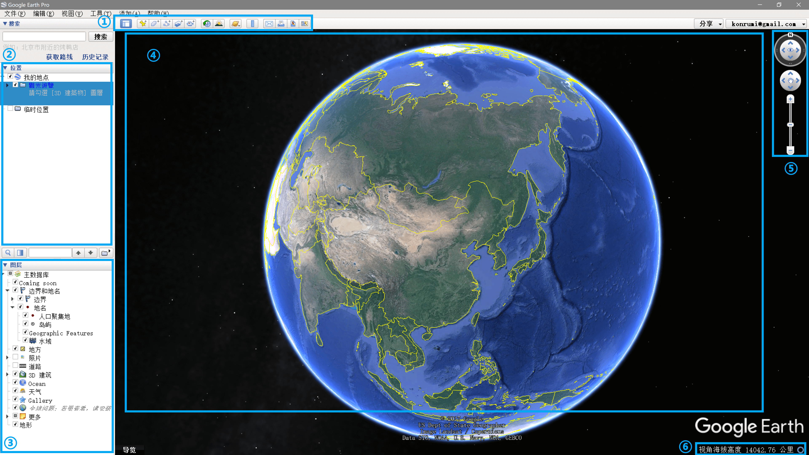

### ① 工具栏

提供各种工具，其中较为常用的是： **添加地标** 、 **添加多边形** 、 **添加路径** 、 **显示历史图像** 、 **显示阳光移动** 、 **保存图片** 等。

### ② 位置面板

显示用户的位置，如航迹、路径、路点等。

### ③ 图层面板

用户可以勾选图层面板中的不同选项，以控制在地球上显示的信息。

### ④ 地球

显示地球信息的区域，可以通过鼠标进行视角操作。

### ⑤ 控制区

除了鼠标之外，通过控制区的按钮和滑杆亦可控制视角。

### ⑥ 信息区

显示当前所在位置的详细信息。

---

## 视角控制

通过鼠标可以控制地图视角，基本操作方法如下：

- **鼠标左键 - 拖动** ：旋转地球（即拖动地图），以查看不同坐标的图像。

- **鼠标中键 - 上下拖动** ：改变视角的倾斜方向。

- **鼠标中键 - 左右拖动** ：在水平方向旋转地球，改变正北朝向。

- **鼠标中键 - 滚轮** ：改变放大等级。

- **鼠标右键 - 上下拖动** ：改变放大等级。

- **鼠标右键 - 左右拖动** ：在缩放时在水平方向旋转地球。

若不习惯鼠标操作，通过右侧控制区的按钮也可控制视角。

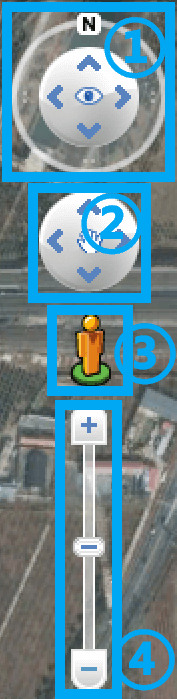

1. 通过外环可旋转地图，点击 **N** 可旋转至正北朝上。点击/拖动内环，可旋转地图或改变视角倾斜方向。
2. 旋转地球（即拖动地图），以查看不同坐标的图像。
3. 拖动小人放置到地图指定位置，即可进入街景模式（模拟以第一人称在地面观察）。
4. 通过滑杆或 **+** 、 **-** 按钮可改变地图放大等级。

---

## 创建/编辑位置

在Google Earth中，可以添加自己的路径或区域，以供野外调查使用。

### 创建目录

为了方便管理即将添加的路径、路点等数据，应当先创建一个目录，再将所有数据统一放置到该目录下，方便后期管理导出。

在 **位置面板** 中，右键点击 **我的地点** 。

在弹出菜单中选择 **添加** - **文件夹** 。

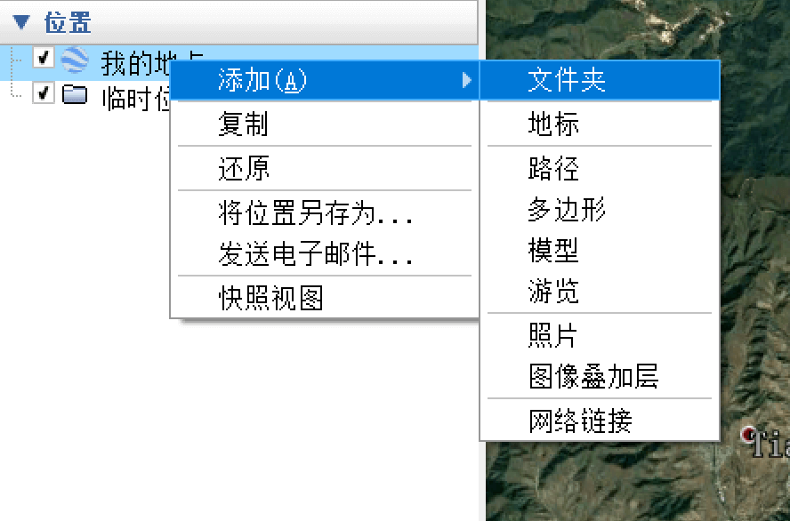

在弹出窗口中，编辑文件夹的基本信息，点击 **OK** 确认。

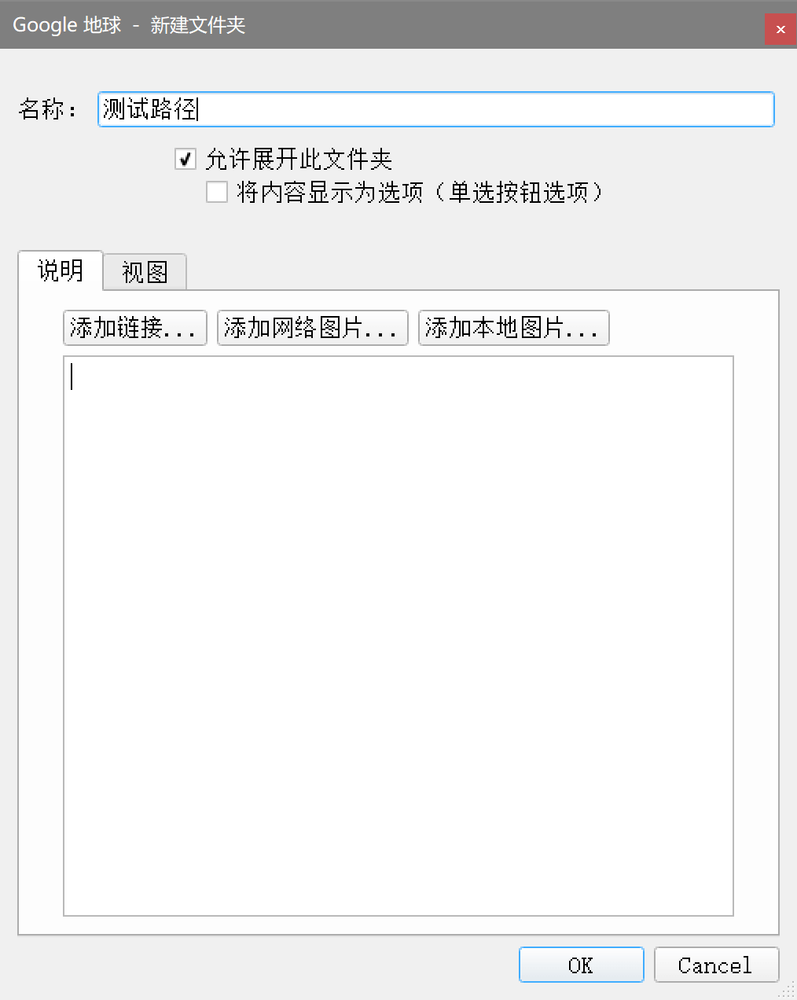

完成后，新建的文件夹将出现在 **位置面板** 。

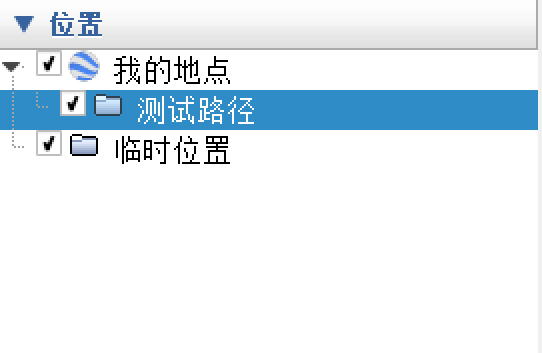

被勾选的目录、数据项将显示在地图中。

### 添加地标

在 **工具栏** 中，点击 **添加地标** 按钮。

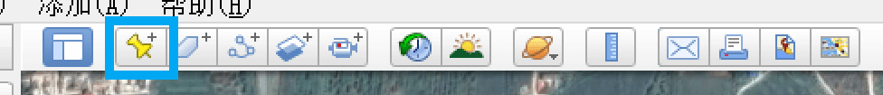

弹出地标属性窗口，在窗口中完善地标信息、修改地标图标，在地图上拖动地标到精确位置。

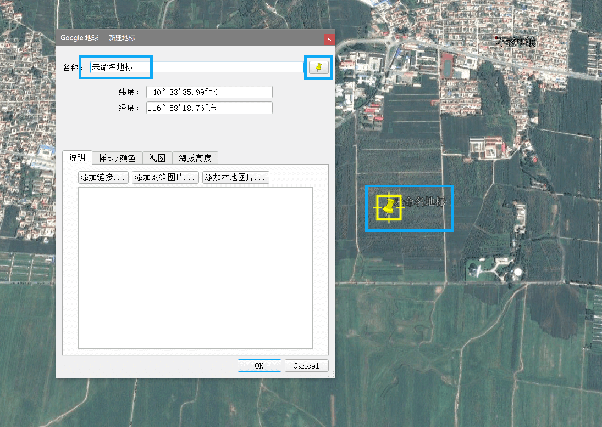

编辑完成后，点击 **OK** 确认。

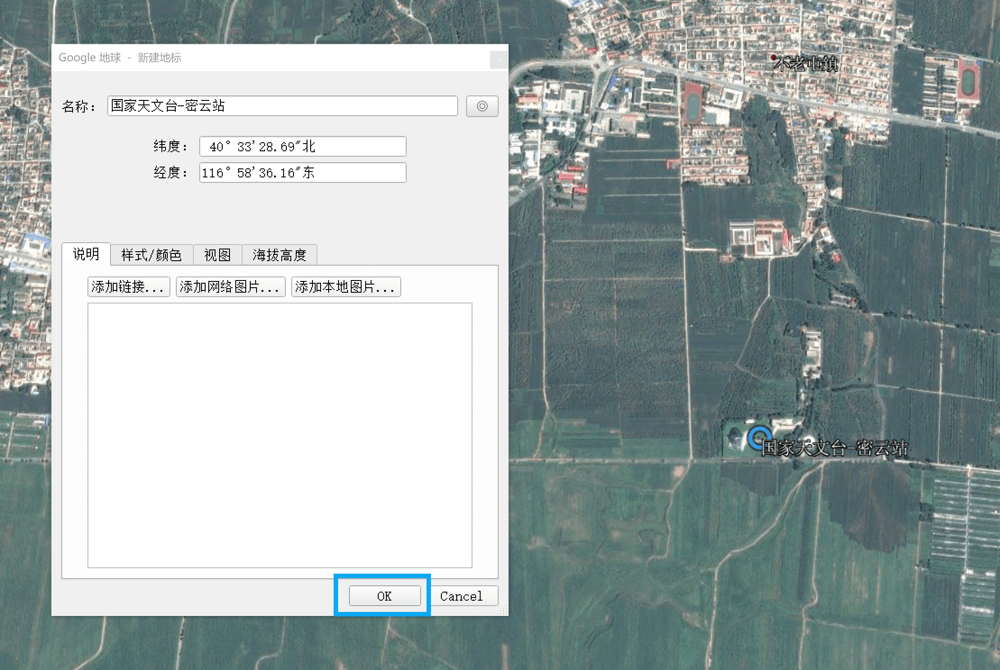

此时地标将被保存在地图上，同时出现在 **位置面板** 中。若此路点不在刚刚添加的目录下，请将其手动拖拽到刚刚添加的目录之中。

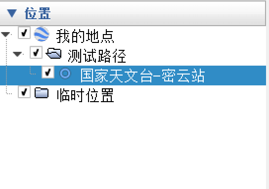

若想再次编辑地标的信息及位置，右键点击地标，在弹出菜单中选择 **属性** ，即可再次编辑地标。

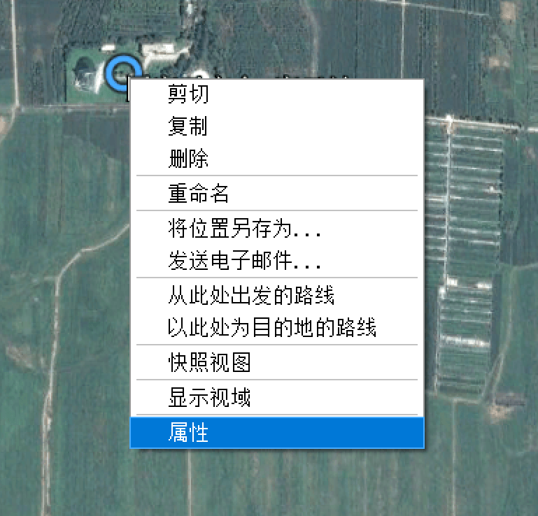

### 添加多边形

在 **工具栏** 中，点击 **添加多边形** 按钮。

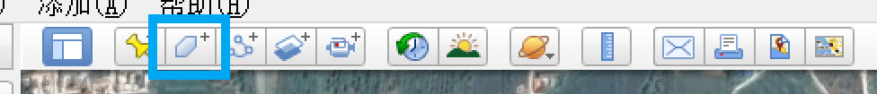

弹出多边形属性窗口，在窗口中完善多边形信息，在地图上点击，勾勒出多边形的形状。通过用鼠标在地图上拖动，可以连续创建拐点，以画出较平滑拟合曲线。

> 注：建议在属性窗口的 **样式/颜色** 选项卡中，修改多边形填充颜色的 **透明度** 。若填充色不透明，则多边形下面的地图将被遮挡。

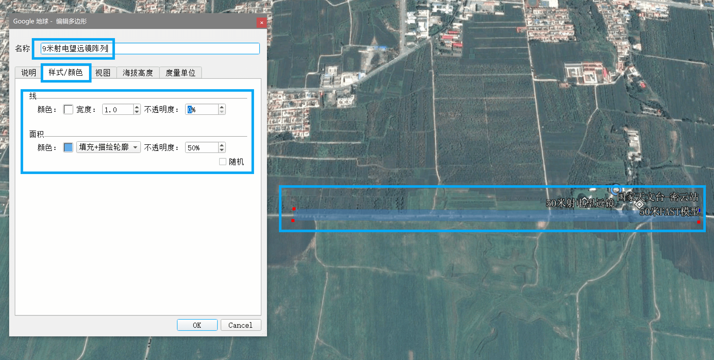

若想再次编辑多边形的信息及位置，在 **位置面板** 中右键点击多边形，在弹出菜单中选择 **属性** ，即可再次编辑多边形。

### 添加路径

在 **工具栏** 中，点击 **添加路径** 按钮。

弹出路径属性窗口，在窗口中完善路径信息，在地图上点击，以创建路径。通过用鼠标在地图上拖动，可以连续创建拐点，以画出较平滑拟合曲线。

> 注：建议在属性窗口的 **样式/颜色** 选项卡中，修改路径的 **宽度**、颜色的 **透明度** 。尽量创建足够明显且不会遮挡地图的路径。

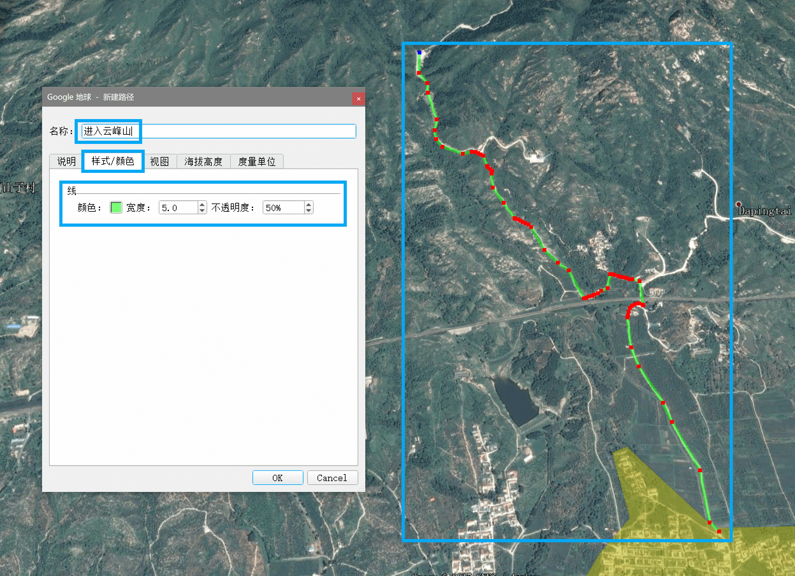

若想再次编辑路径的信息及位置，在 **位置面板** 中右键点击路径，在弹出菜单中选择 **属性** ，即可再次编辑路径。

### 保存位置到数据文件

在位置面板中，首先确保需要保存的地标、轨迹等处于同一个目录内。

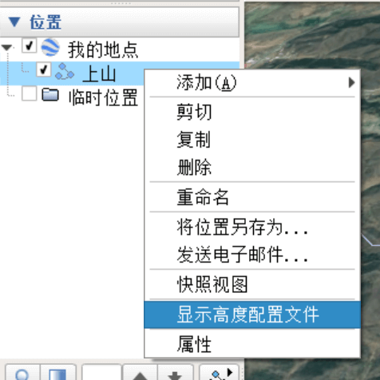

右键单击目录，在弹出菜单中选择 **将位置另存为…** ，或选中目录后，按下键盘的 **`Ctrl+S`** 。

在弹出菜单中，将位置保存至 `kml` 或 `kmz` 文件即可。

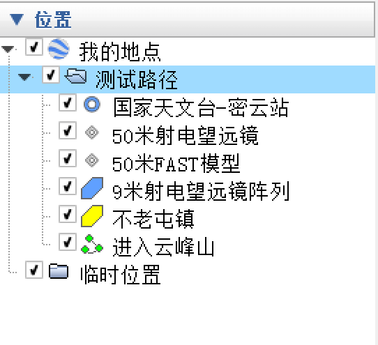

---

## 导入数据文件

可以将已有的位置数据文件显示在Google Earth中，再次查看或编辑。

可以通过以下方式导入一个数据文件：

1. 点击菜单栏中的 **文件** - **打开…**
2. 使用键盘快捷键 **Ctrl+O**
3. 直接将数据文件拖动到Google Earth界面中

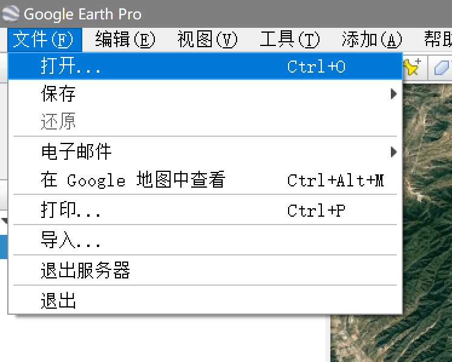

打开后，被导入的位置将出现在 **位置面板** 中的 **临时位置** 中。且地图将定位到位置所在的坐标。

若导入的是GPS航迹文件（附带 `时间-坐标` 映射的轨迹），界面中将出现时间控制窗口。

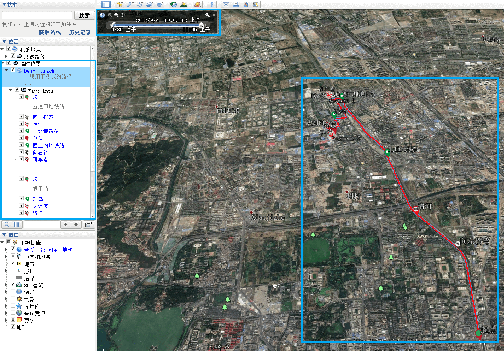

> 应注意区分 **航迹** 与 **路径** 的概念。
>
> - **航迹（Track）** ：一段时序的GPS轨迹信息集合，即一段 `时间-坐标` 的映射关系的集合，反映了某个时间点的位置信息。
> - **路径（Path）** ：单纯的由点构成的线段集合，与事件无关。
>
> 由Google Earch创建的为不带时间信息的 **路径（Path）** ，而GPS轨迹记录仪创建的通常为具有时间信息的 **航迹（Track）** 。
> **航迹（Track）** 只需去掉其时间信息，即可转化为 **路径（Path）** 。

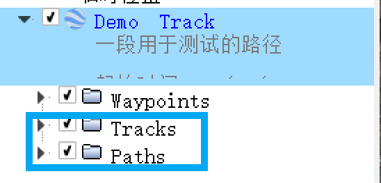

若导入的是具有时间信息的 **航迹（Track）** ，则可通过顶部的时间控制窗口，调整时间轴，地图上将显示不同时间在该航迹中对应的位置。

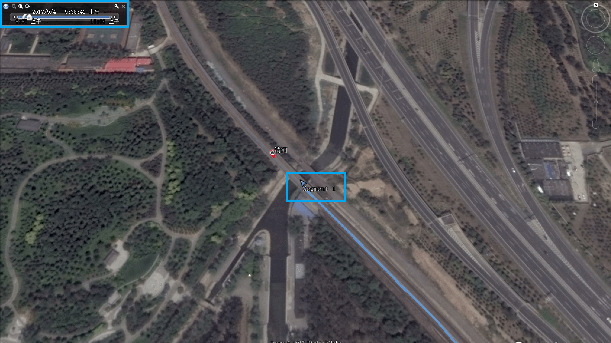

位置导入后，即可用之前所述的方法进行编辑。

在 **位置面板** 中，用户可以摘取其中的地标、路径到已有的位置信息中，也可在其中添加新的地标、路径。

在临时位置上右键，可以将位置保存到 **我的地点** ，这样关闭Google Earth后，位置将被保存在Google Earth本地数据库中，再次打开也不会丢失。也可以点击 **将位置另存为…** 将位置直接保存成数据文件。

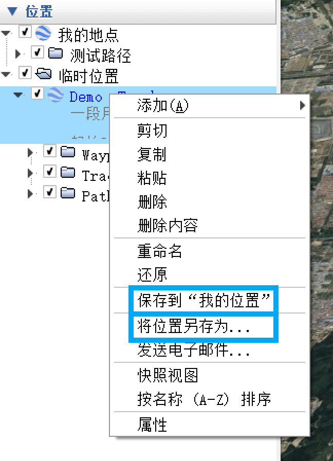
