# OruxMaps

**OruxMaps**可以查看在线、离线地图，可以查看导入的轨迹文件，可以利用手机的各类传感器记录轨迹信息，以供后期使用。

本章主要介绍猫盟野外调查工作中需要用到的基础功能，包括：离线地图、轨迹跟踪、轨迹记录、点位标记等。此外OruxMaps还有许多高级功能，可访问[官方文档](http://www.oruxmaps.com/oruxmapsmanual_zh.pdf "OruxMaps中文文档")查看。

## 获取App

OruxMaps可以从官网下载点下载，目前（2017年9月6日）版本为`v.7.1.4`。若您发现了新版本，可[通知作者](https://github.com/konrumi/field-investigation-startup/issues/new "提出Issues")更新此文章。

- [官网下载地址](http://www.oruxmaps.com/OruxMaps7.1.4.apk "OruxMaps v.7.1.4 官网下载")
- [百度网盘下载地址](https://pan.baidu.com/s/1ge2t6mv "OruxMaps v.7.1.4 百度网盘下载") // 密码: `akk9`

---

## 基础功能

// TODO

---

## 离线地图下载

在野外调查时，难免会进入没有信号的地区，因此推荐预先安装不依赖网络的离线地图。

OruxMaps官网提供了许多地图来源，可参见[地图下载页](http://www.oruxmaps.com/cs/en/maps "OruxMaps地图下载")。本书中，推荐[OpenAndroMaps](https://www.openandromaps.org/en/downloads "OpenAndroMaps")提供的矢量离线地图。当然。您也可以根据需求与喜好自行选择。

> OpenAndroMaps地图的优势：
> - 包含中国地区；
> - 适量地图，支持放大查看细节；
> - 带有等高线，支持查看地形；
> - 支持多语言，带有中文地名；

离线地图的安装方法主要有两种—— **在APP中下载安装离线地图** 、 **在PC下载离线地图传至手机安装** 。

### 在APP中下载安装离线地图

在OruxMaps App内，可直接下载OpenAndroMaps地图。但是由于各种原因，如果下载失败，清尝试通过PC下载。

点击右上角的 **地图** 按钮，在弹出菜单中，选择 **切换地图** 。


点击右上角的 **⊕（添加）** 按钮。

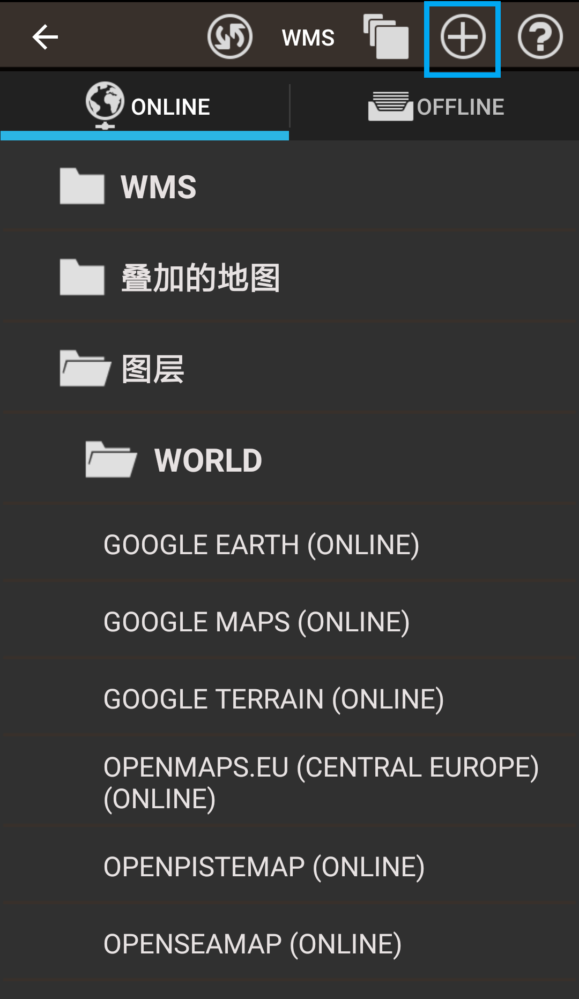

在最后的 **World** 中，选择 **OpenAndroMaps** 。


选择后，将进入APP浏览器访问OpenAndroMaps网站。用户需要分别下载 **主题文件** 与 **地图文件** 。后续的步骤与PC下载类似，因此请参考下面的PC教程。

---

### 在PC下载离线地图传至手机安装

为正确显示等高线等信息，需下载配套的 **主题文件：Elevate** 。

访问 **[OpenAndroMaps官网](https://www.openandromaps.org/en/downloads "OpenAndroMaps")** ，进入 **[Elevate主题文件下载页](https://www.openandromaps.org/en/legend/elevate-mountain-hike-theme "Elevate下载")** 。


若希望使用App安装，点击左侧的 **OruxMaps** ；若希望在PC下载，点击右侧的 **Normal Version** 。


若在App内下载，则安装应该能够自动完成。若正常下载，则您应当得到一个Zip压缩包。

解压缩后，将得到的文件存入手机的 `../oruxmaps/mapstyles/` 目录下即可。连接手机可通过各种软件完成，如 **[豌豆荚](http://www.wandoujia.com/)** 等。为了将手机连接至电脑，你可能需要启用手机的USB调试模式。

> 注：在安装手机管理软件时，请务必注意甄别安装选项，以免安装多余内容。

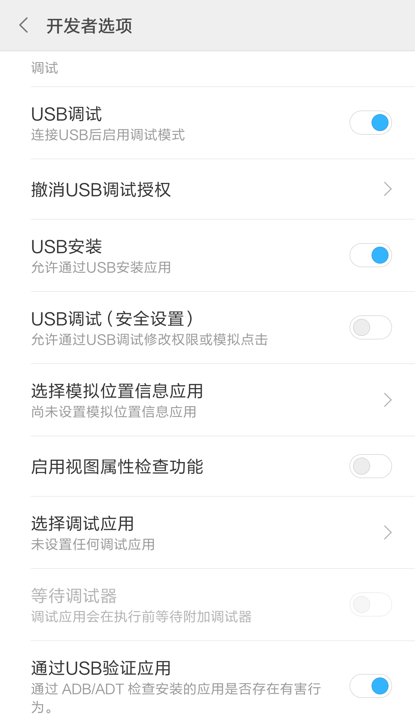


安装完成后，打开OruxMaps App，点击右上角的 **地图** 按钮，在弹出菜单中，选择 **Map tweaks（调整地图）** 。


在弹出菜单中，选择 **OSM主题** ，然后选择刚安装的 **Elevate** 主题即可。


---

准备好样式文件后，即可下载安装地图文件。

访问 **[OpenAndroMaps官网](https://www.openandromaps.org/en/downloads "OpenAndroMaps")** ，进入 **[地图文件下载页](https://www.openandromaps.org/en/downloads/countrys-and-regions "地图文件下载")** 。


在地图文件下载页，选择希望下载的目标区域，这里选择 **[亚洲/中东区域](https://www.openandromaps.org/en/downloads/asia-middle-east "亚洲/中东区域")** 。


在列表中，选择调查区域所述的位置，如 **中国北方** ，随后在展开的页面中选择下载。另外，也应该下载 **Poi包** 。

若在App内下载，则安装应该能够自动完成。若正常下载，则您应当得到一个地图Zip压缩包和PoiZip压缩包。


解压缩后，将地图文件和Poi文件存入手机的 `../oruxmaps/mapfiles/` 目录下即可。


安装完成后，打开OruxMaps App，点击右上角的 **地图** 按钮，在弹出菜单中，选择 **切换地图** 。


在弹出界面中，选择上方的 **OFFLINE** ，再选择刚刚安装的 **CHINA-NORTH_ML(MAPSFORGE)** 地图即可。

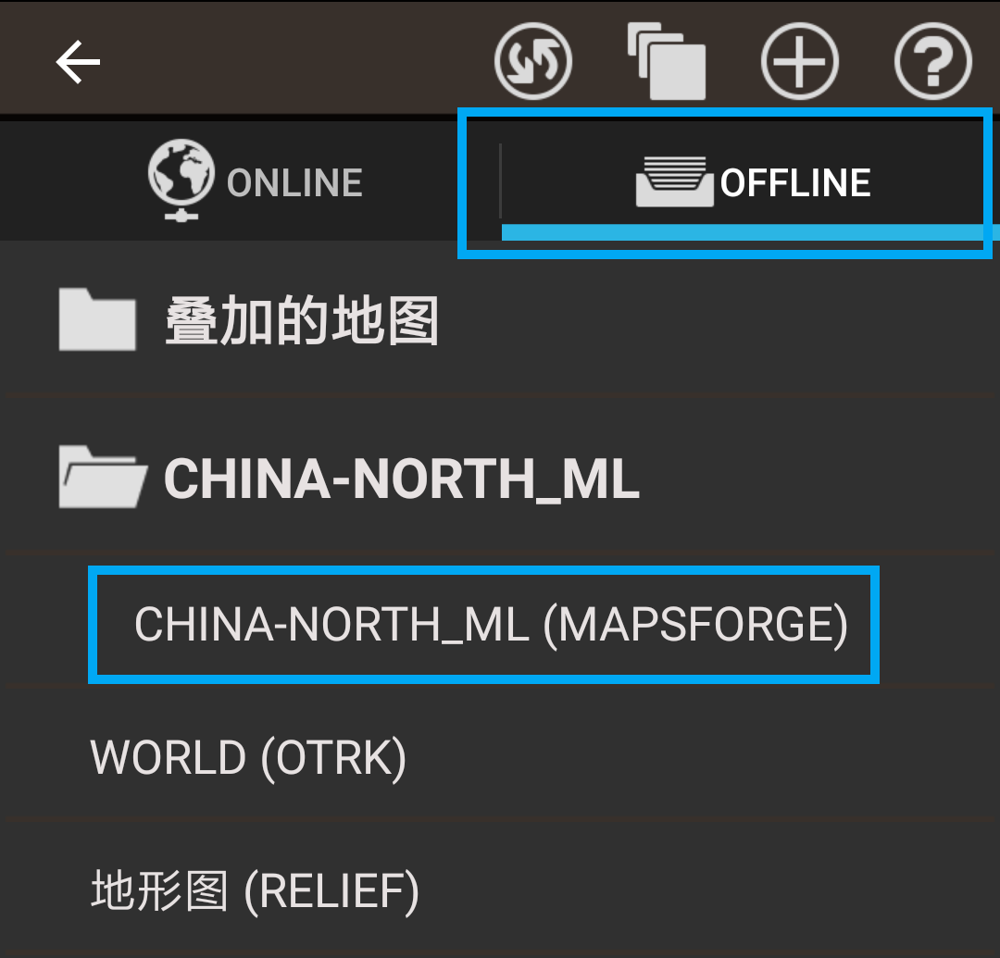

---

## 添加Google地图

野外调查中，除了矢量的离线地图以外，我们往往还需要更能体现当地自然环境的卫星地图。Google Earth是目前比较成功的卫星地图提供商。虽然Google的许多产品由于众所周知的原因在大陆并不可用，但是我们仍然可以使用Google Maps CN提供的服务，只需要把Google的地图来源添加到OruxMaps中即可。

OruxMaps使用 `onlinemapsources.xml` 文件管理在线地图的来源。我们可以在其中加入以下3个Google Maps CN的地图源。

如果觉得麻烦，你也可以直接下载编辑好的 [`onlinemapsources.xml`](../asset/map-tools/onlinemapsources.xml) 。

```xml
<onlinemapsource uid="0">
    <name>Google Maps</name>
    <url><![CDATA[http://mt{$s}.google.cn/vt/lyrs=m@121&hl={$l}&x={$x}&y={$y}&z={$z}]]></url>
    <minzoom>0</minzoom>
    <maxzoom>19</maxzoom>
    <projection>MERCATORESFERICA</projection>
    <servers>0,1,2,3</servers>
    <httpparam name=""></httpparam>
    <cacheable>1</cacheable>
    <downloadable>1</downloadable>
    <maxtilesday>0</maxtilesday>
    <maxthreads>0</maxthreads>
    <xop></xop>
    <yop></yop>
    <zop></zop>
    <qop></qop>
    <sop></sop>
</onlinemapsource>

<onlinemapsource uid="1">
    <name>Google Earth</name>
    <url><![CDATA[http://www.google.cn/maps/vt?lyrs=s@168&x={$x}&y={$y}&z={$z}]]></url>
    <minzoom>0</minzoom>
    <maxzoom>20</maxzoom>
    <projection>MERCATORESFERICA</projection>
    <servers>0,1,2,3</servers>
    <httpparam name=""></httpparam>
    <cacheable>1</cacheable>
    <downloadable>1</downloadable>
    <maxtilesday>0</maxtilesday>
    <maxthreads>0</maxthreads>
    <xop></xop>
    <yop></yop>
    <zop></zop>
    <qop></qop>
    <sop></sop>
</onlinemapsource>

<onlinemapsource uid="2">
    <name>Google Terrain</name>
    <url><![CDATA[http://mt{$s}.google.cn/vt/lyrs=t,r&hl={$l}&x={$x}&y={$y}&z={$z}]]></url>
    <minzoom>0</minzoom>
    <maxzoom>15</maxzoom>
    <projection>MERCATORESFERICA</projection>
    <servers>0,1,2,3</servers>
    <httpparam name=""></httpparam>
    <cacheable>1</cacheable>
    <downloadable>1</downloadable>
    <maxtilesday>0</maxtilesday>
    <maxthreads>0</maxthreads>
    <xop></xop>
    <yop></yop>
    <zop></zop>
    <qop></qop>
    <sop></sop>
</onlinemapsource>
```

完成后，将添加了Google地图源的 `onlinemapsources.xml` 文件放入 `../oruxmaps/mapfiles/` 目录下即可。

> 注：每次OruxMaps升级后，都会创建一个新的 `onlinemapsources.xml` ，而旧的 `onlinemapsources.xml` 会被重命名为 `onlinemapsources.xml.bak` 文件保存在相同位置。升级后请手动替换 `onlinemapsources.xml` 文件。


完成后，打开OruxMaps App，点击右上角的 **地图** 按钮，在弹出菜单中，选择 **切换地图** 。


在弹出界面中，选择上方的 **刷新** ，刚刚添加的Google地图应该就会出现在列表中。

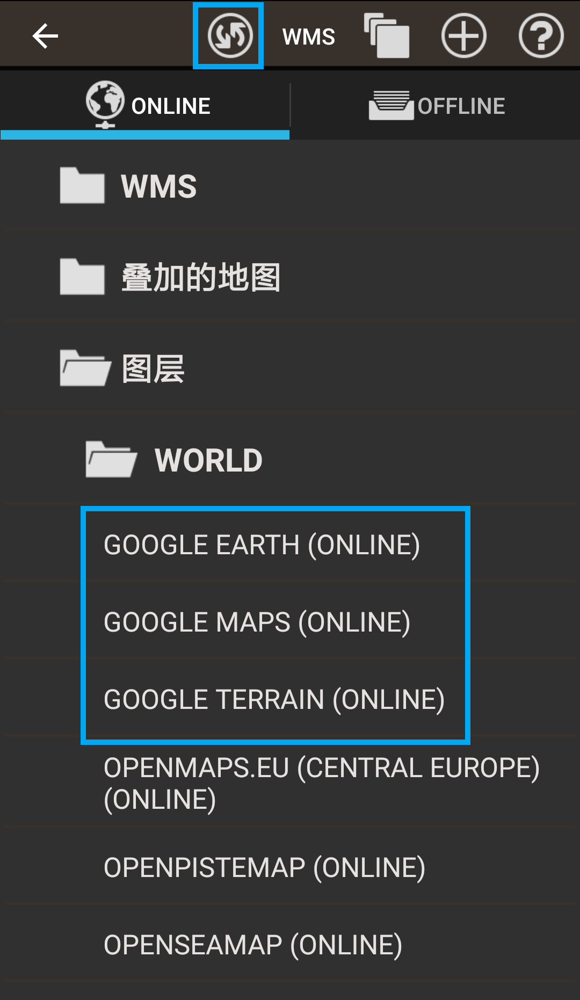

---

选择Google Earth地图后，我们即可在线查看Google Earth卫星地图了。但是在野外调查中，时常遇到没有信号的情况，因此我们也可以预先将卫星地图下好，作为离线地图。

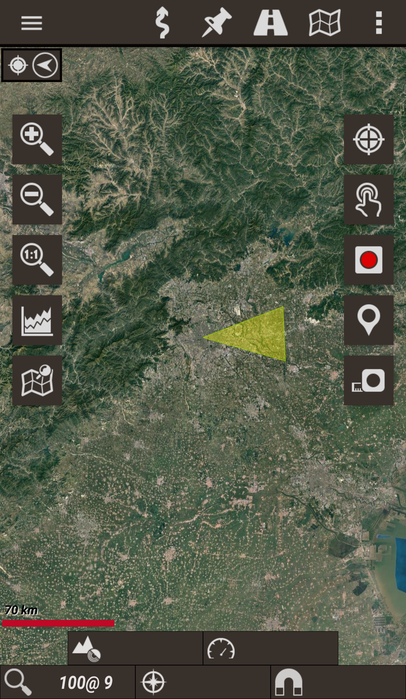

打开OruxMaps App，点击右上角的 **地图** 按钮，在弹出菜单中，选择 **Map tools（地图工具）** 。

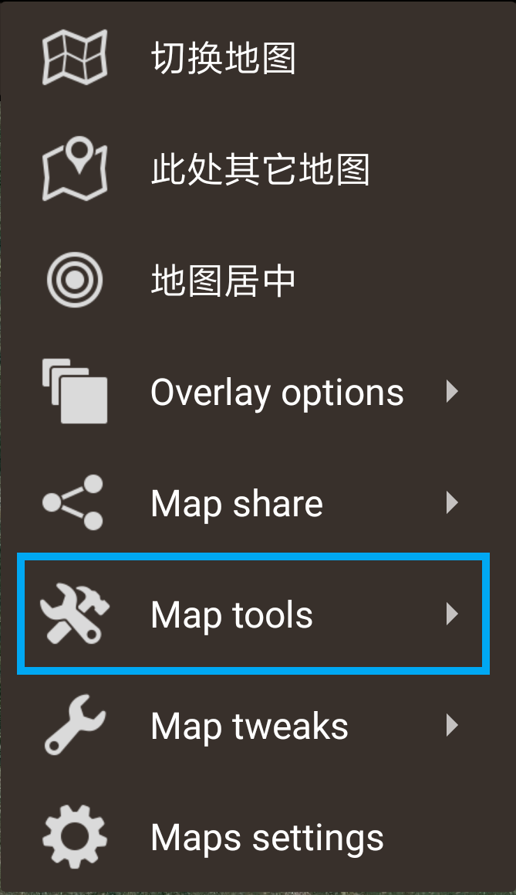

在弹出菜单中，选择 **创建地图** 。

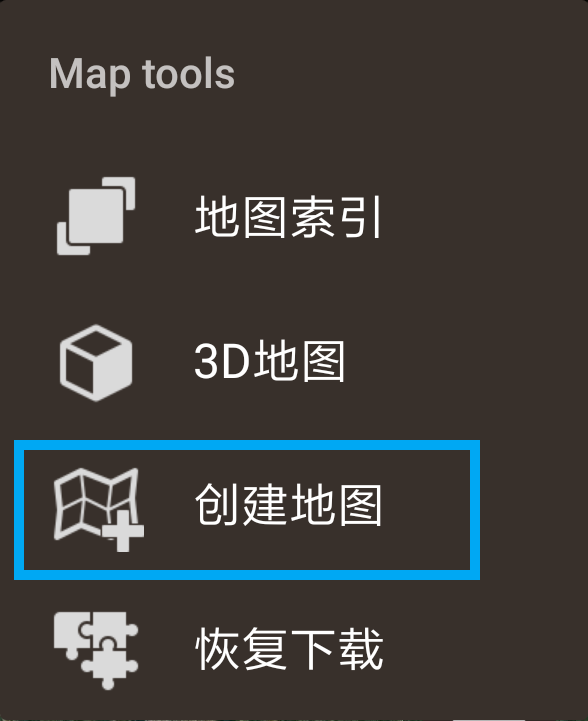


此时进入区域选择界面，在地图上点击，以选择需要下载的区域的 **左上** 、 **右下** 顶点。形成的矩形范围，即为需要预先下载的离线地图的范围。选择完成后，点击底部的 **对钩** 以确认范围。

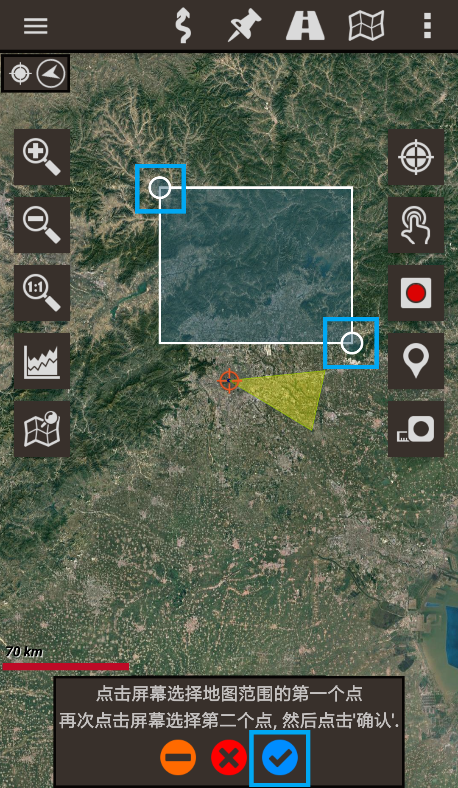

在弹出界面中，勾选地图图层粒度。数字越大，粒度越细，地图细节越好，需要下载的图片也就越多。一般下载到 **15~16** 级即可。然后输入地图名称，即可开始下载。

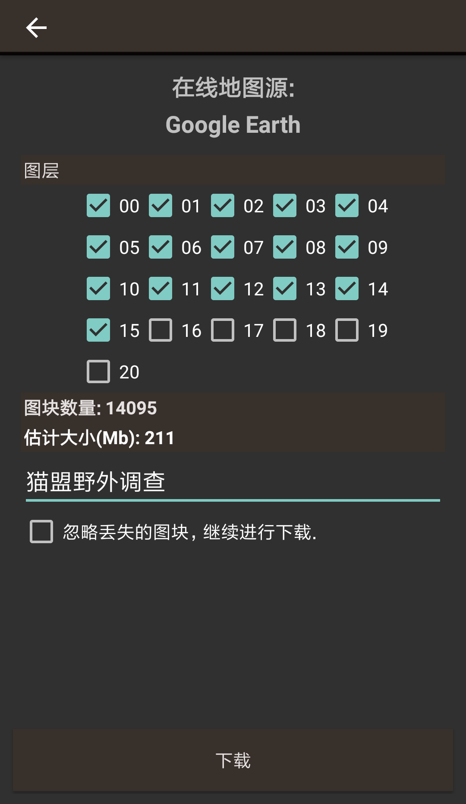


根据选择的图层粒度与区域大小，下载将持续一段时间。

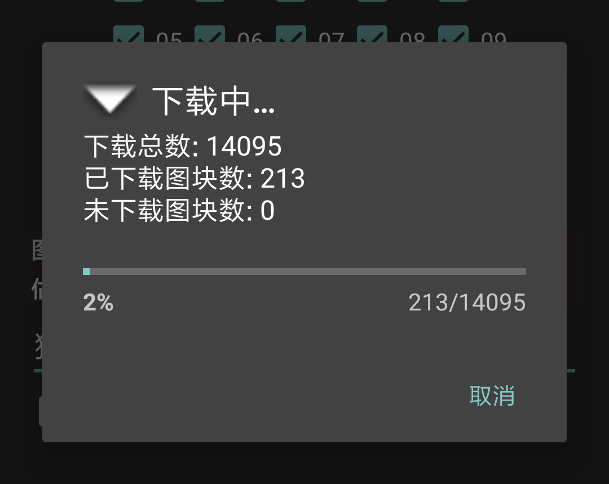


下载完成后，即会成功创建一个新的地图。退出创建地图界面，进入 **切换地图** 界面，选择 **OFFLINE** ，点击顶部的 **刷新** 按钮，即可看到刚刚创建的Goole Earth离线地图。需要使用时，切换到该地图即可。


> 注：需要删除时，在地图列表长按希望删除的地图，即可将其删除。

---

## 使用3D地图

在下载了Google Earth卫星地图后，我们有时还需要查看地形信息，我们可以通过下载DEM文件，获取高度信息，通过OruxMaps的3D地图功能查看地形信息。

点击右上角的 **地图** 按钮，在弹出菜单中，选择 **Map tools（地图工具）** 。

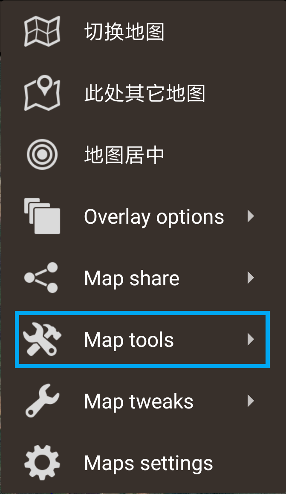

在弹出的菜单中，选择 **3D地图**

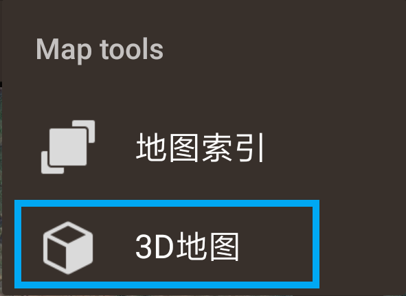

如果此处没有用于保存高度信息的DEM文件，OruxMaps会提示你下载，点击 **确定** 以下载。

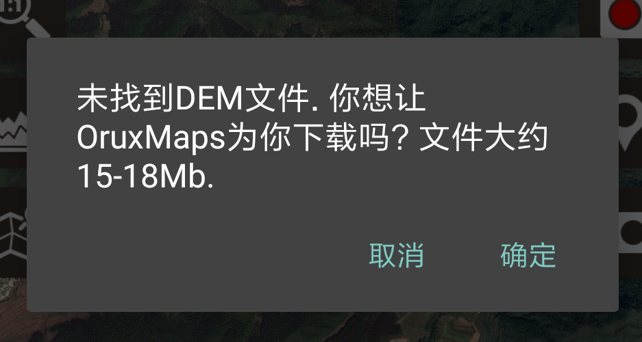

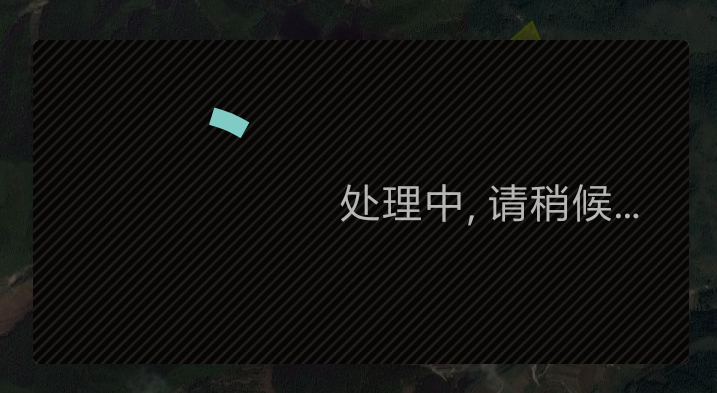

下载完成后，即可在3D地图界面中查看地形信息。


---

## 记录轨迹

OruxMaps App的另一项实用功能，是支持记录行进的GPS轨迹，在有价值的地方标记点位。在野外调查中，这也是一项非常有用的功能。
