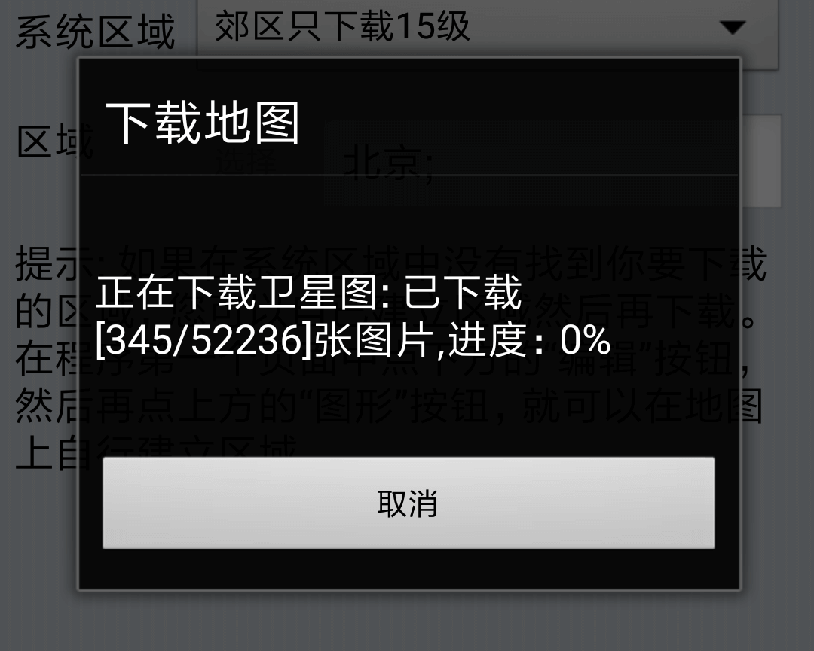
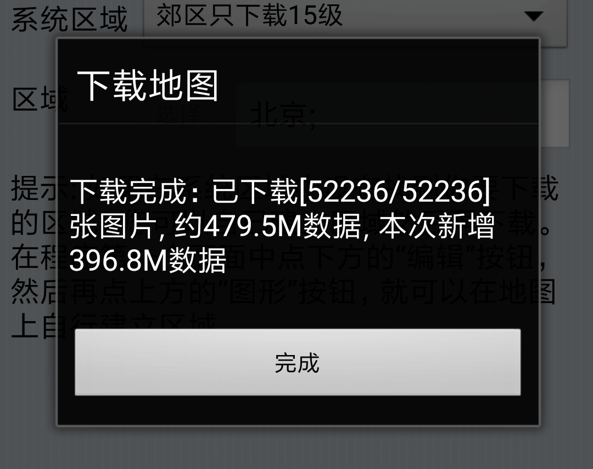
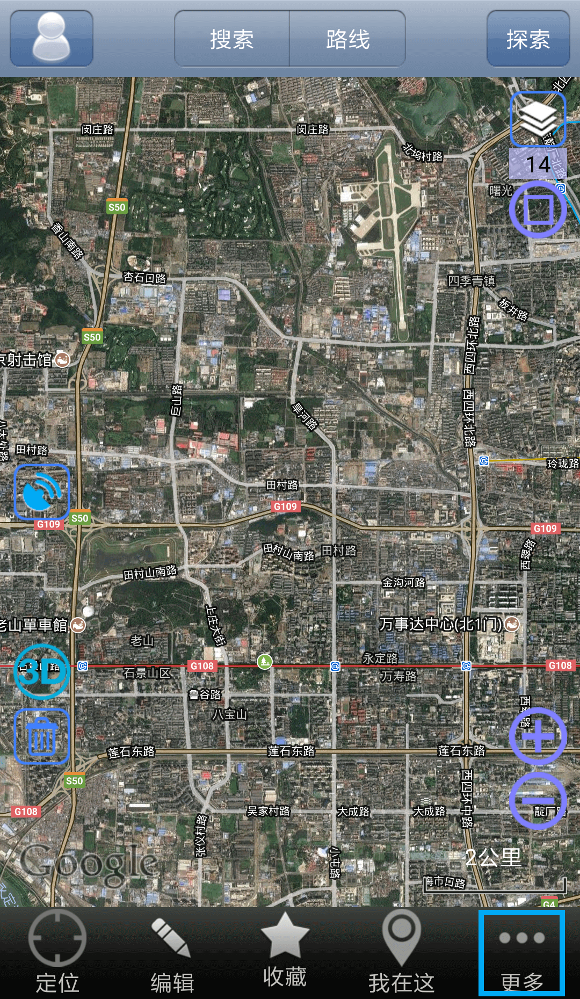
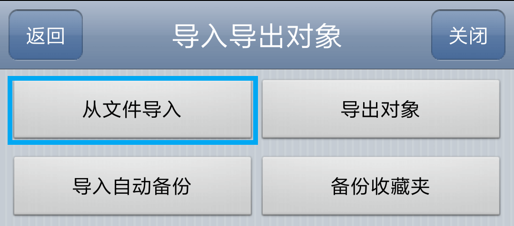
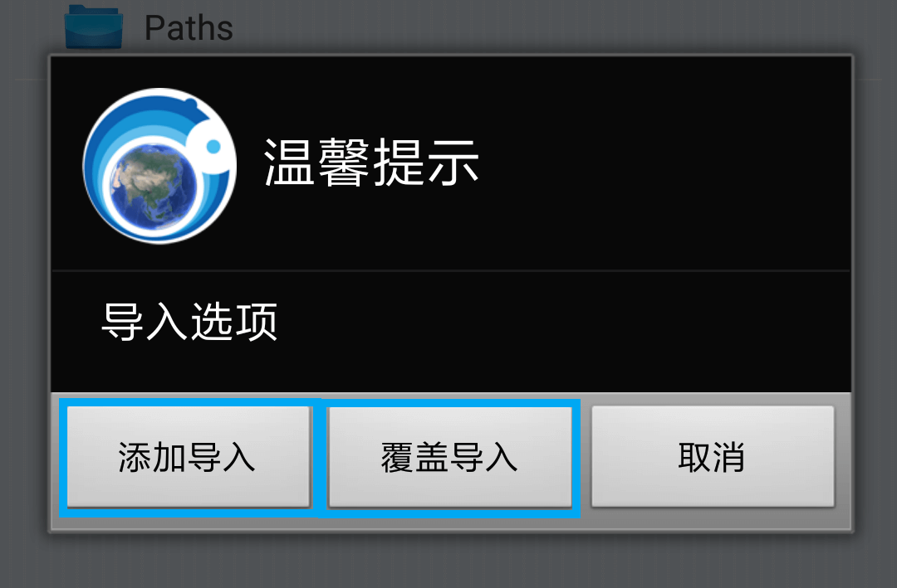
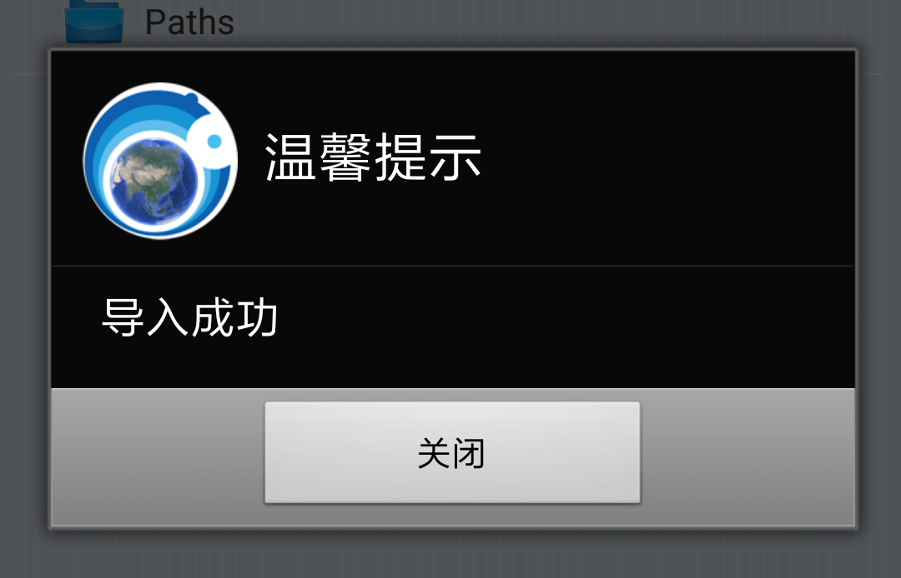
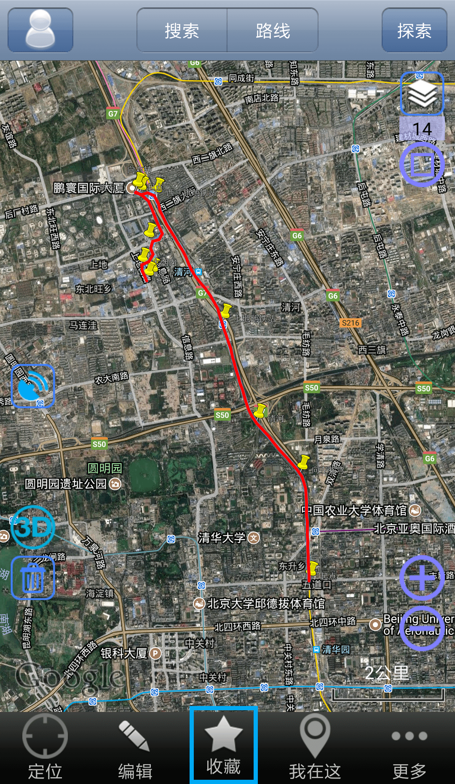

# 奥维互动地图

**奥维互动地图** 为一款国产地图App，支持 `iOS` 及 `Android` 平台，具有简单易用的优点，目前基础功能可免费使用。

## 获取App

- `iOS` 客户端

  直接访问[App Store](https://itunes.apple.com/cn/app/ao-wei-hu-dong-de-tu-liu-lan-qi/id505884327 "奥维互动地图iOS")下载安装即可。

- `Android` 客户端

  访问各大应用市场，搜索 **奥维** 下载安装即可。

  亦可访问[官网下载页面](http://www.ovital.com/download/ "奥维互动地图官网下载")，下载安装文件进行安装。

---

## 基础功能

---

## 地图

奥维互动地图提供多种在线地图可供选择，用户可根据需求选择自己希望的地图进行查看。

### 选择地图

点击App底部菜单的 **更多** 按钮。或直接点击页面右侧快捷入口处的 **选择地图** 按钮，直接进入选择地图界面。

在更多界面，选择 **选择地图** 选项。

在选择地图界面，选择希望显示的地图即可。

---

### 离线存储地图图块

在野外调查中，时常遇到没有信号的情况，因此我们也可以预先下载地图图块，作为离线地图。

点击App底部菜单的 **更多** 按钮。

在更多界面，选择 **下载地图** 选项。

在下载地图界面，选择 **选择** 按钮，以选择需要下载图块的区域。

勾选所需要下载的地图区域后，点击右上角的 **确定** 按钮。

确认其他下载选项后，点击右上角的 **下载** 按钮。

> - 地图类型：选择需要下载的地图。
> - 地图级别：选择需要下载的地图图层粒度。数字越大，粒度越细，地图细节越好，需要下载的图片也就越多。
> - 系统区域：选择郊区是否以选择的地图级别下载。野外调查的目标区域通常为非城镇区域，建议选择 **郊区同市区一样处理** 。

点击后，App会弹出授权确认窗口，选择 **我已获得授权** 即可。

开始下载前，可以选择 **计算大小** 或 **直接下载** 。

> - **计算大小** ：下载前先估算需要下载的图块大小。
> - **直接下载** ：直接开始图块下载。

若选择 **计算大小** ，则App会先行计算需要下载的图块的大小。

计算完成后，点击 **下载** 即可开始下载。

等待App下载地图图块。

地图图库爱下载完成后，将继续下载地图路网。

完成下载后，App将弹出提示。

---

## 航迹

### 记录GPS航迹

// TODO

### 从数据文件载入航迹

我们可以将进行野外调查前，事先准备好的航迹/路点文件，导入奥维互动地图，以在野外调查时比对查看。

点击App底部菜单的 **更多** 按钮。

在更多界面，选择 **导入导出对象** 选项。

选择 **从文件导入** 选项。

在文件导入界面，选择希望导入的数据文件。

选择后，点击右上角的 **导入** 按钮。

导入前，可以选择 **添加导入** 或 **覆盖导入** 。

完成导入后，App将弹出提示。

此时，带入的航迹将显示在地图上。

需要管理导入的数据文件，可点击App底部菜单的 **收藏** 按钮。

在收藏界面，可以对已有的数据文件进行管理。

> - 点击文件左侧的 **显示/隐藏（眼睛图标）** 按钮可切换航迹在地图上的显示/隐藏。
> - 点击右上角的 **菜单** 按钮，可显示菜单，在菜单中点击 **编辑** 选项，可对导入的数据文件进行删除等操作。
> - 点击文件右侧的 **详细** 按钮，可查看数据文件的详情。

