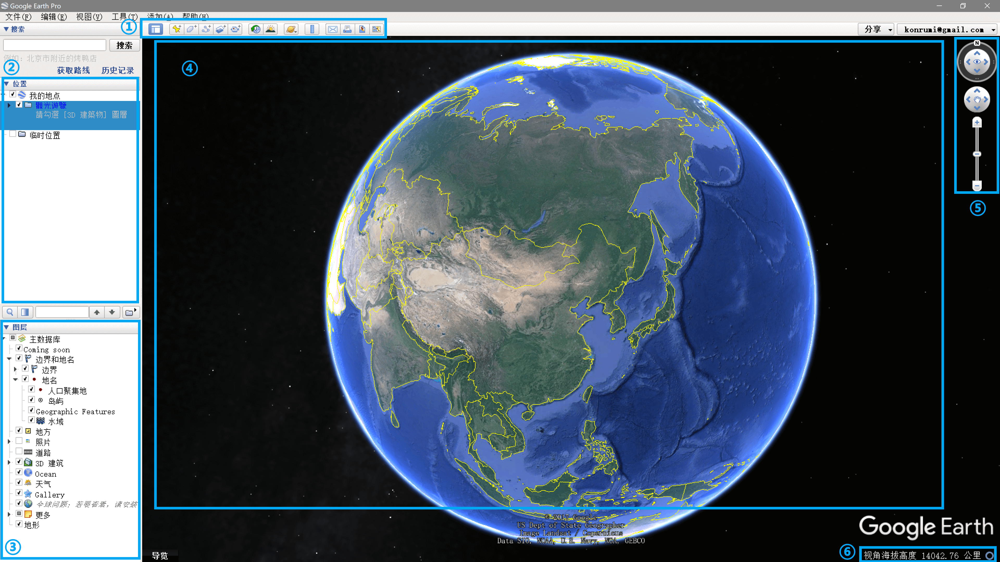

# Google Earth

**Google Earth** 是由Google开发的一款地图工具，目前可供使用的有 **Web版** 、 **桌面版** 两种版本。

主要功能是查看区域的 **地图** 、 **卫星图片** ，以及 **查看/编辑航迹** 等。

## 获取软件

目前Google Earth持续更新的是Web版本，通过浏览器直接访问即可。此外，Google　Earth也提供桌面端使用的可执行程序版本。

### Web App

很不幸，由于众所周知的原因，Google Earth的服务无法在大陆正常访问。但是如果你拥有科学上网的条件，可以尝试最新的Web版 Google Earth。

- [Web版Google Earth](https://www.google.com/intl/zh-CN/earth/ "Web版Google Earth")

---

### 桌面端

Google Earth的桌面版软件可在官网下载，但也需要科学上网。所幸，即便没有科学上网的条件，亦可在其他下载站点下载。

> 注：在下载安装Google Earth时，请务必注意甄别安装来源和选项，以免对个人手机电脑造成负面影响。

- [Google官网下载](https://www.google.com/intl/zh-CN/earth/desktop/ "Google Earth")
- [uptodown网站下载](https://google-earth-pro.cn.uptodown.com/windows "Google Earth")

---

## 基础功能

Google Earth的软件界面大致如下：

### ① 工具栏

提供各种工具，其中较为常用的是： **添加地标** 、 **添加多边形** 、 **添加路径** 、 **显示历史图像** 、 **显示阳光移动** 、 **保存图片** 等。

### ② 位置面板

显示用户的位置，如航迹、路径、路点等。

### ③ 图层面板

用户可以勾选图层面板中的不同选项，以控制在地球上显示的信息。

### ④ 地球

显示地球信息的区域，可以通过鼠标进行视角操作。

### ⑤ 控制区

除了鼠标之外，通过控制区的按钮和滑杆亦可控制视角。

### ⑥ 信息区

显示当前所在位置的详细信息。

---
